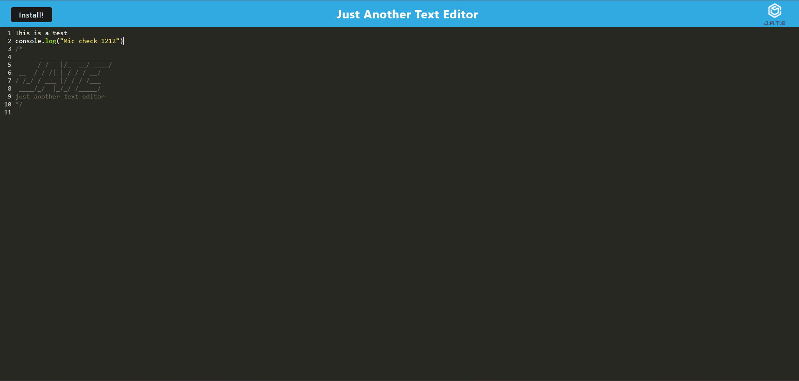

# Just Another Text Editor (J.A.T.E.)

## Description

Just Another Text Editor (J.A.T.E.) is a Progressive Web Application (PWA) that allows you to create notes or code snippets with or without an internet connection. This application features a number of data persistence techniques that serve as redundancy in case one of the options is not supported by the browser. The application also functions offline and can be installed directly to your device.

## Table of Contents

- [Installation](#installation)
- [Usage](#usage)
- [Features](#features)
- [Screenshots](#screenshots)
- [License](#license)
- [Contributing](#contributing)
- [Questions](#questions)

## Installation
Visit the site Render https://pwa-text-editor-c7zk.onrender.com/

-or-

To install and run this application locally:

1. Clone the repository to your local machine:
   ```bash
   git clone <your-repository-url>
   ```
2. Navigate to the project directory:
   ```bash
   cd your-project-directory
   ```
3. Install the necessary dependencies:
   ```bash
   npm install
   ```
4. Build the application:
   ```bash
   npm run build
   ```
5. Start the application:
   ```bash
   npm run start
   ```

The application will be available at `http://localhost:3000` in your browser.


## Usage

- **Online and Offline Usage**: The application allows you to create and save notes or code snippets both online and offline.
- **PWA Installation**: You can install the application to your device by clicking on the "Install" button.
- **Data Persistence**: The application saves your notes to `IndexedDB` and automatically retrieves them when the application is reloaded.

### Using the Editor

1. Open the application in your browser.
2. Type your notes or code snippets into the text editor.
3. The content will automatically save when you click outside of the editor.
4. You can close and reopen the application, and your content will be retrieved from `IndexedDB`.

## Features

- **Progressive Web App**: Works offline and can be installed on your device.
- **Data Persistence**: Saves content to `IndexedDB` for offline retrieval.
- **Service Worker**: Caches assets to ensure the application works offline.
- **Webpack**: Bundles JavaScript files and generates the necessary service worker and manifest files.

## Screenshots




## License

This project is licensed under the MIT License. See the [LICENSE](LICENSE) file for details.

## Contributing

Contributions are welcome! Please feel free to submit a Pull Request.

## Questions

If you have any questions about this project, please feel free to reach out:

- **GitHub**: DJDevJams github.com/djdevjams
- **Email**: alex.art.brown@gmail.com
